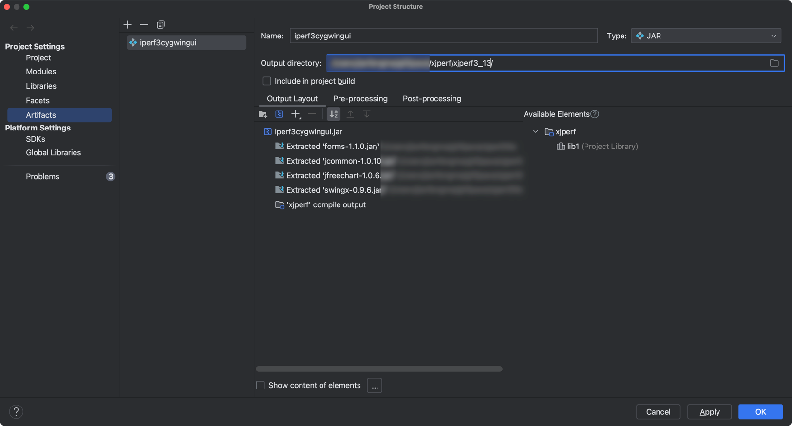

# iperf3 GUI

### Version：
- iperf 3.13

### 使用:
- openjdk 1.8.0_372+

### build:
1. mkdir -p xjperf3_13/bin
2. java 1.8.0_372+
    
3. Build -> Build Artifacts
4. unzip iperf-3.13-win64.zip -d xjperf3_13/bin
5. zip -r xjperf3_13.zip xjperf3_13/
